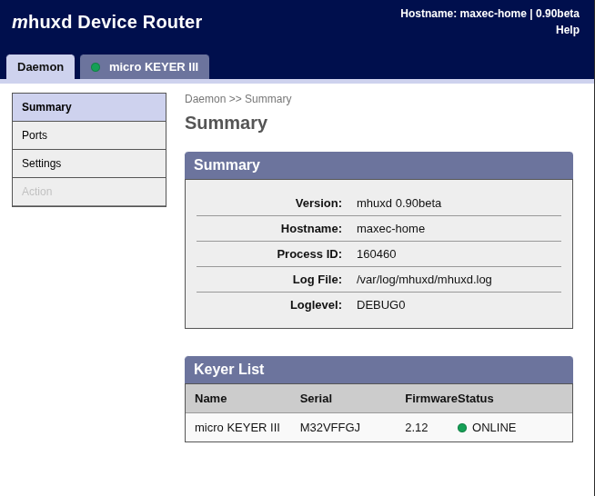
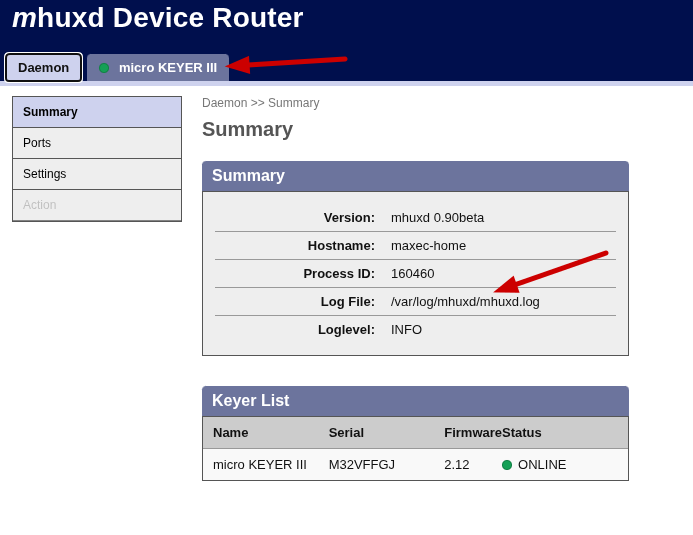
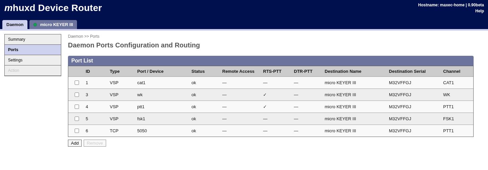
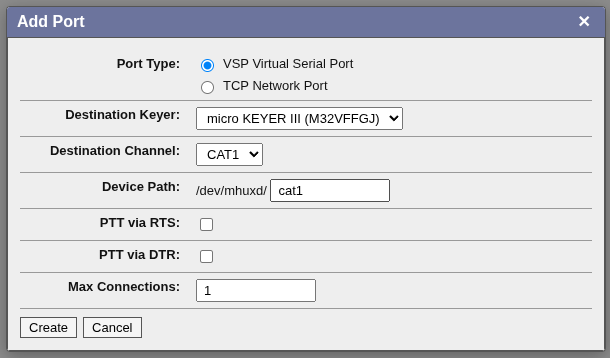
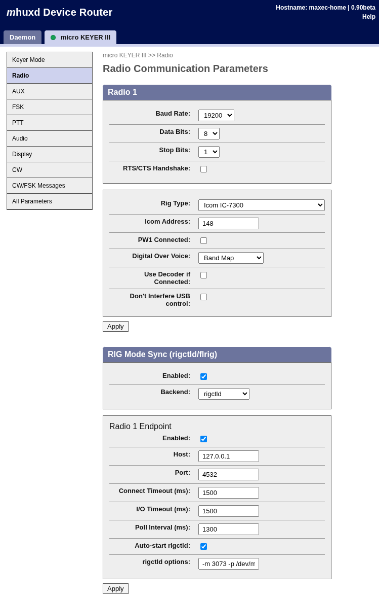
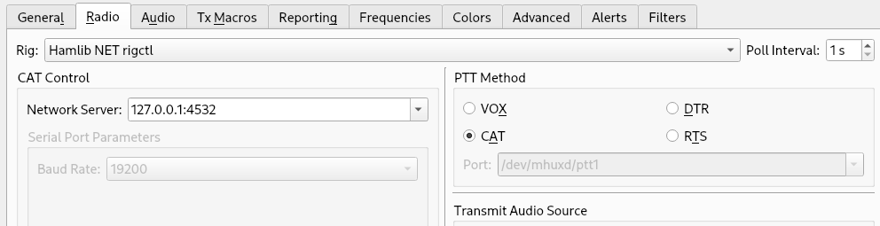
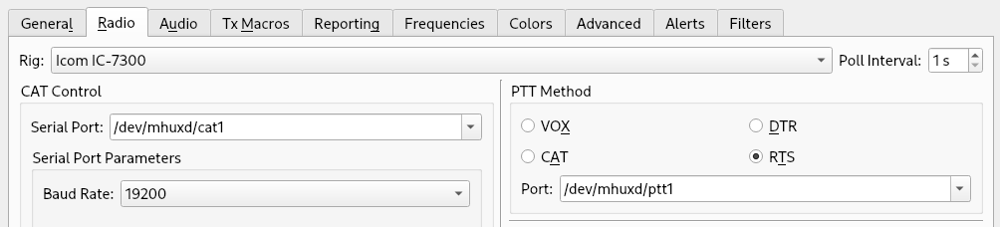

# mhuxd MicroHam Keyer Device Router
(C) 2012-2026 Matthias Moeller, DJ5QV




## New in v0.90

- Web UI migrated to a JS/Svelte based version. New UI is default under http://localhost:5052. Old UI can still be accessed via 
  http://localhost:5052/classic. However, old UI is not maintained anymore.

- Internal Clearsilver/HDF based configuration management migrated to JSON. Clearsilver still included for backward compatibility with
  the old config file. If mhuxd doesn't find a json format config file, it will attempt to load the hdf config and migrate it to json.
  (mhuxd-state.hdf -> mhuxd-state.json)

- Rest-API interface, used by the Web-UI to interact with mhuxd.

- Websocket interface, providing status changes.

- Can communicate with rigctld. This solves an issue where keyer internal CAT queries are enabled while an application like WSJTX runs 
  CAT queries, too, leading to collisions and instability. Using rigctld, mhuxd can sync the rig mode and frequency with the keyer.
  It also allows multiple applications to use CAT simultaneously.

- WebUI and TCP connector support IPv6 now.


---

## ABOUT

**Homepage:** [http://mhuxd.dj5qv.de](http://mhuxd.dj5qv.de)

Mhuxd is a device router for microHam keyers for the Linux operating system. Supported microHam keyers are:

- micro KEYER
- micro KEYER II
- micro KEYER III
- DIGI KEYER
- DIGI KEYER II
- MK2R & MK2R+
- CW KEYER
- Experimental: Station Master (DeLuxe)

mhuxd provides a web interface for configuration. It allows performing keyer configuration changes, including Winkey configuration. Once mhuxd is running, the web interfaces can be accessed at:

[http://localhost:5052](http://localhost:5052)

This can be changed by the `-w` option.

Similar to the microHam device router, mhuxd can create virtual serial ports. This allows ham radio applications like CQRLOG or Fldigi to send rig commands or utilize the K1EL Winkey chip. These ports can be created using the web interface.


## INSTALLATION

### Binary packages

Binary packages are available for Debian (and derived distributions, Ubuntu, Mint). Refer to [mhuxd.dj5qv.de](https://mhuxd.dj5qv.de/) for details.

Installing from these packages is the easiest way, like plug & play. Everything is handled automatically: systemd integration, permissions, account creation, etc.

### Compile from source code

The steps here are a little more complex than for usual programs. mhuxd will run
under the mhuxd account, which will be created below. Though possible, I'd advise against running it under your normal user.

Install required packages:


```bash
## Install required packages
# for Debian and Ubuntu:
sudo apt install acl git pkgconf automake autoconf make gcc libev-dev libfuse-dev libudev-dev libjansson-dev

# for Arch Linux
pacman -S --needed pkgconf git automake autoconf make gcc libev fuse systemd-libs jansson

# for Alpine Linux (you might need to compile the kernel, the provided ones seem to lack cuse/CONFIG_CUSE)
apk add pkgconf git automake autoconf make gcc libev-dev fuse-dev libudev-zero-dev jansson-dev musl-dev acl

# Get the source code from github:
git clone https://github.com/dj5qv/mhuxd.git
cd mhuxd

# Create configure script:
./autogen.sh

# Build mhuxd
mkdir build && cd build
../configure --prefix=/usr/local/mhuxd
make

# create mhuxd user and group. These will be the owners of virtual serial ports in /dev/mhuxd/
sudo useradd --system --home-dir /nonexistent --no-create-home --user-group mhuxd
sudo usermod -G dialout mhuxd # for Arch Linux use 'uucp' instead of 'dialout'

# Install it into your $HOME directory, mhuxd folder:
sudo make install

# Make var writable for mhuxd user:
sudo chown -R mhuxd:mhuxd /usr/local/mhuxd/var

# Allow read/write on /dev/cuse for mhuxd user. This will not survive a reboot, next step will fix that.
sudo /usr/bin/setfacl -m u:mhuxd:rw /dev/cuse

# Do set acl for /dev/cuse and the right ownership for virtual serial ports in /dev/mhuxd,
# copy the udev file into the appropriate system directory:
sudo cp ../debian/mhuxd.udev /usr/lib/udev/rules.d/59-mhuxd.rules

# Make sure kernel module get's loaded after boot
echo cuse | sudo tee /etc/modules-load.d/cuse.conf

# And reload the udev rules (or reboot):
sudo udevadm control --reload-rules

```

To build Debian packages, run `make deb` in a configured source tree (needs `dpkg-dev` and `debhelper`).

## Run it
### When installed from package (.deb)
When installed from binary package, mhuxd **should already be running**. 
Access the Web UI via browser at: http://localhost:5052/  
Check the log file in /var/log/mhuxd/mhuxd.log for any errors.

```bash
# Stop mhuxd:
systemctl stop mhuxd
# Start mhuxd:
systemctl start mhuxd

# Or, if you use init scripts instead of systemd:
/etc/init.d/mhuxd stop
/etc/init.d/mhuxd start
```

### When self compiled
If you compiled mhuxd yourself, it can be started "manually" on the command line. 
As described in the compile section, mhuxd should run under account mhuxd:
```bash

# make sure, kernel module cuse is loaded:
sudo modprobe cuse

# Start mhuxd in foreground, output goes to the terminal, not the log file.
# Terminate with Ctrl-C:
sudo su - mhuxd -c "exec /usr/local/mhuxd/sbin/mhuxd"

# Start mhuxd in background, output goes into the log file:
sudo su - mhuxd -c "exec /usr/local/mhuxd/sbin/mhuxd -b"


# With relaxed sudo settings, this should work, too:
sudo -u mhuxd /usr/local/mhuxd/sbin/mhuxd 

# Or in background:
sudo -u mhuxd /usr/local/mhuxd/sbin/mhuxd -b

# To stop the daemon, when running in background:
kill `cat /usr/local/mhuxd/var/run/mhuxd/mhuxd.pid`
```

## Quick setup

## Make sure mhuxd has recognized your keyer

If your keyer is connected to the computer and turned on, mhuxd should have recognized it 
immediately. In the Web-UI a dedicated tab should show up for that keyer:



If the keyer tab is not showing up, check the log file for any errors.


## Create virtual serial ports (VSP)


Readily configured set of VSP and TCP ports for the MKIII:



You'd likely see an empty list here. Click the add button:



Click "Create" and the VSP will be created. If an error is indicated, check the log to see what went wrong.
For a PTT port you'd want to select RTS and / or DTR.

### Configure CAT / radio



- Select your radio model and serial settings that match your radio.
- "Use decoder if connected" would enable internal CAT polling from keyer to radio. 
   That is used to keep the keyer in sync with the rig's operating mode and frequency.
- "Don't interfere USB control": This should prevent CAT polls from the keyer while some
   program on the computer already runs CAT polls. For me that is not working anymore
   with my current setup (IC-7300, MKIII, WSJTX), so I have 
   disabled both.  

- Section "Rig Mode Sync", this enables the use of hamlib's rigctld. With this 
  feature mhuxd can run CAT queries to identify the current operating mode and QRG.
  It can then set mode and QRG in the keyer accordingly.
- rigctld allows multiple applications to connect to it and run CAT queries simultaneously, 
  without interference. So WSJTX, fldigi, QLog can, when configured to use rigctld, at the
  same time run CAT queries.
- mhuxd can "manage" rigctld (auto-start rigctld enabled). Whenever the corresponding keyer 
  gets turned on or connected to the computer, mhuxd will start a rigctld instance. Once 
  the keyer gets disconnected or turned off, mhuxd will terminate rigctld.
- When enabling "auto-start rigctld", you need to provide the correct rigctld parameters
  in field "rigctld options":

```
-m 3073 -p /dev/mhuxd/ptt1 -P RTS -r /dev/mhuxd/cat1 -vv
```
**-m 3073** => is the hamlib rig model number, IC-7300 in this case. rigctld -l prints a list.  
**-p /dev/mhuxd/ptt1 -P RTS** => this tells rigctld the PTT port and to use RTS to toggle PTT.  
**-r /dev/mhuxd/cat1** => the CAT port to connect to.  


Example, WSJTX CAT setting to connect to a locally running rigctld:



Although CAT PTT is enabled, that is not really CAT PTT from the rig's perspective. rigctld
will translate this to RTS via /dev/mhuxd/ptt1, if configured like shown above. The keyer will
then trigger PTT via PTT line, not CAT.

Of course WSJTX could also be configured completely without rigctld, directly accessing the virtual
serial ports provided by mhuxd. In that case, no other application can open these ports anymore:



For this to work, "Rig mode sync" must be disabled. Otherwise /dev/mhuxd/cat1 would be occupied by 
rigctld already.

## ACKNOWLEDGEMENTS

- **microHam** - For providing the protocol specs and support
- **Marc Lehmann and Emanuele Giaquinta** - For libev
- **Brandon Long** - For the ClearSilver template system
- **Igor Sysoev, Joyent Inc. et al.** - For http\_parser
- **Google Inc., Filipe Almeida** - For streamhtmlparser
- **Petri Lehtinen** - For libjansson
